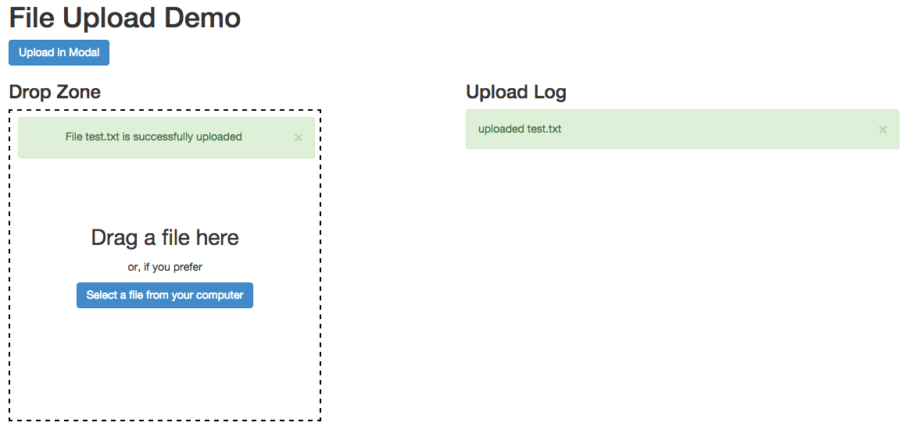

node-angular-file-upload
========================

Simple one click file upload with AngularJS (directive and demo).

Features:
- drop zone
- select file
- upload progress
- upload modal service
- immediate upload on file drop/file select

 
 
## Links
 
[angular-file-upload](https://github.com/nervgh/angular-file-upload) AngularJS file upload library

[Gulp](http://gulpjs.com/) Streaming build system

[Bower](http://bower.io/) Package manager for the web
